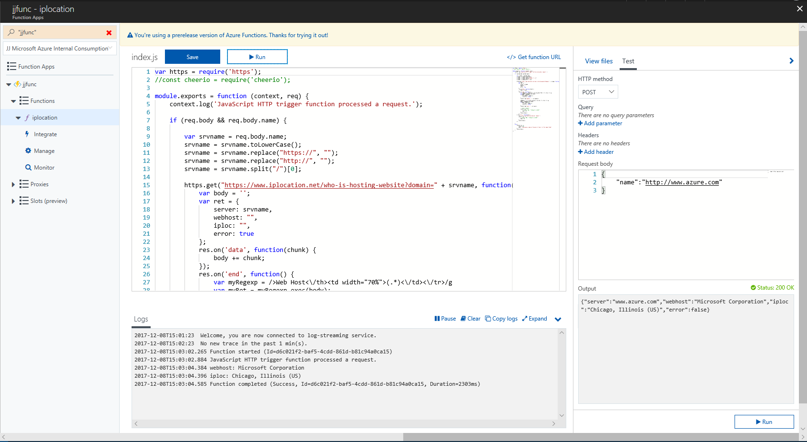

# JJ Azure Function in Javascript
This repo contains Azure Function created with Visual Studio Code.

Using this VS Code [extension](https://marketplace.visualstudio.com/items?itemName=ms-azuretools.vscode-azurefunctions)

Make sure you have supported NodeJS [link](https://nodejs.org/en/download/package-manager/#debian-and-ubuntu-based-linux-distributions)

## Setup local development
Follow this [instructions](https://docs.microsoft.com/en-us/azure/azure-functions/functions-run-local)

Open Visual Studio Code, clone my repo. Publish Function from VS Code extension Azure Functions.

## How to Debug
[Instructions](https://docs.microsoft.com/en-us/azure/azure-functions/functions-run-local)

Start Function and attach Debugger
```bash
func host start --debug vscode
```

## IpLocation Function
This function receives geolocation of ip address (thanks to @valda-z).




