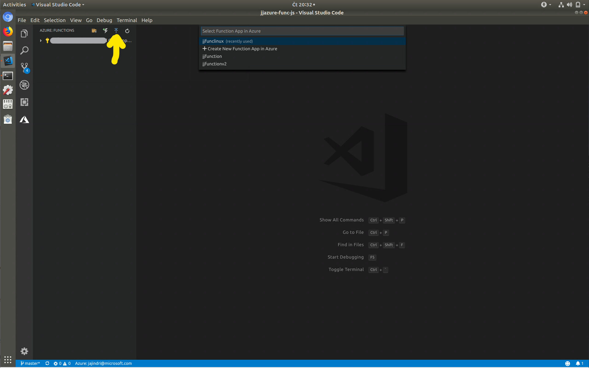
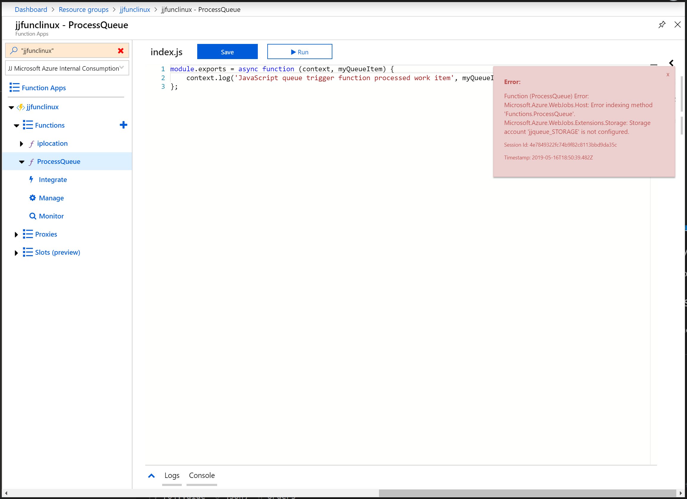

# JJ Azure Function in Javascript
This repo contains Azure Function created with Visual Studio Code and hosting in Azure Functions on Linux.

Using this VS Code [extension](https://marketplace.visualstudio.com/items?itemName=ms-azuretools.vscode-azurefunctions)

Make sure you have supported NodeJS [link](https://nodejs.org/en/download/package-manager/#debian-and-ubuntu-based-linux-distributions)

## Setup local development
Follow this [instructions](https://docs.microsoft.com/en-us/azure/azure-functions/functions-run-local)

Open Visual Studio Code, clone my repo. Publish Function from VS Code extension Azure Functions.

## How to Debug
[Instructions](https://docs.microsoft.com/en-us/azure/azure-functions/functions-run-local)

Start Function and attach Debugger
```bash
func host start --debug vscode
```

## How to deploy in Azure

### Create Azure Function on Linux

We are using ARM template to deploy it, if you want change parameters file.

```bash
cd deploy
az group create -n jjfunclinux -l westeurope
az group deployment create -g jjfunclinux --template-file azuredeploy.json --parameters azuredeploy-params.json
```

Go to Azure Portal and check Azure Function is running, try to create new function from portal.

### Prepare queue in Azure Storage Queue

For following function we need to create queue:
```bash
az storage queue create --account-name jjqueue --account-key $(az storage account keys list -g jjfunclinux -n jjqueue --query [0].value -o json) -n orders
```

### Deploy function in Azure

Function is located in src directory. **You will be asked to select home directory of function**, select src directory.



When will be sucessfully deployed, you will get message about it.

Next go to the Azure Portal and check functions are deployed.



As you can see, you are getting error about missing **jjqueue_STORAGE** connection string. You have to add connection string.

1. Go to storage account jjqueue and copy connection string: Storage Account -> Access keys
2. Paste this into Functions configuration

Sample connection string:
DefaultEndpointsProtocol=https;AccountName=jjqueue;AccountKey=AAAAAAAAAAAAAAAAAAAAAAAAAAAAAAAAA==;EndpointSuffix=core.windows.net

Function will be automatically reload. Go to back to Azure Function blade and select function. Check no error is displayed.

## Function: ProcessQueue

This function process message in orders queue jjqueue storage account.

How to test it ? Go to Azure Portal, select jjqueue storage account and add new message. In parallel open Azure Portal with this Azure Function and check Log console. There will be new log about processing new message.

## Function: IpLocation

This function receives geolocation of ip address (thanks to @valda-z).


